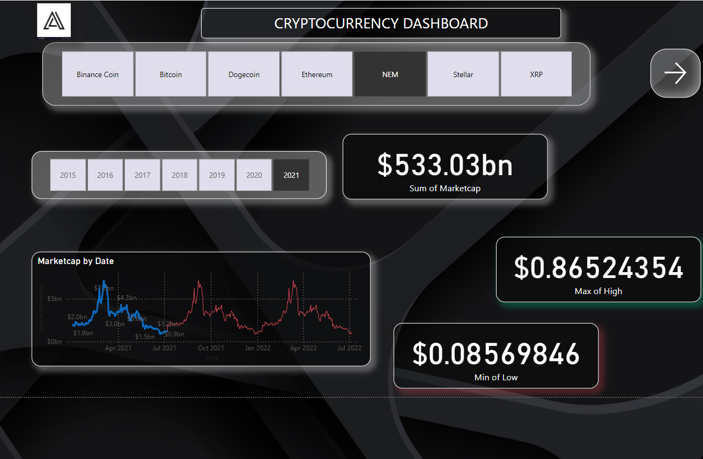
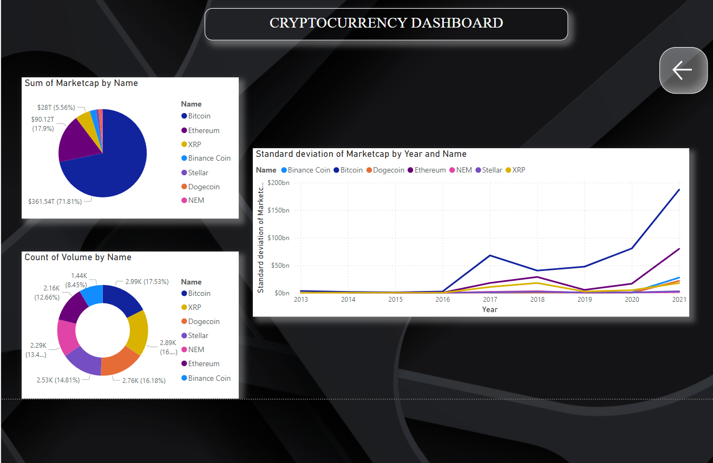

# 🚀 Cryptocurrency Dashboard

## 🌟 Overview

Welcome to the **Cryptocurrency Dashboard**, a **Power BI** project that transforms cryptocurrency data into **beautiful, interactive visualizations**. 📊  
Track market trends, analyze key metrics, and explore the growth of popular cryptocurrencies like **Bitcoin** and **Ethereum** over time. 💹

Whether you're a casual enthusiast or a professional trader, this dashboard provides a powerful tool to stay informed. 🧑‍💻

---

## 🔥 Features

- **🎛️ Dynamic Filters**:  
  - Filter by cryptocurrency (e.g., Bitcoin, Ethereum, XRP).  
  - Explore data trends across multiple years (2015-2021).  

- **📈 Key Metrics**:  
  - **📊 Market Cap**: Total market capitalization.  
  - **📈 Max of High**: Highest recorded value.  
  - **📉 Min of Low**: Lowest recorded value.  

- **🎨 Interactive Visualizations**:  
  - **Market Cap by Date**: A dynamic line chart tracking trends over time.  
  - **Market Cap by Name**: A pie chart showcasing each cryptocurrency's share.  
  - **Trading Volume by Name**: A donut chart of volume distribution.  
  - **Standard Deviation of Market Cap**: A line chart analyzing variability.

- **🖤 Modern Design**:  
  - A sleek black-themed UI for better readability and style.  

---

## 💡 Data Insights

### 📊 Market Trends:
- Observe **significant growth** and periods of **correction** across cryptocurrencies.  
- Identify **market highs and lows** to stay ahead of the curve.  

### 💰 Cryptocurrency Distribution:
- Bitcoin dominates the market, while Ethereum and altcoins continue to gain momentum.  

### 📅 Yearly Analysis:
- Discover how the cryptocurrency landscape evolved over the years.  

---

## 🛠️ Tools and Technologies

- **🔧 Power BI**:  
  - For seamless data visualization and dashboard design.  

- **📂 Data Source**:  
  - Historical cryptocurrency market data.  

---

## 📷 Dashboard Preview

### Page 1


### Page 2


---

## 🚀 How to Use

1. **Clone the repository**:  
   ```bash
   git clone https://github.com/agam25rpro/CryptoCurrency-Dashboard
